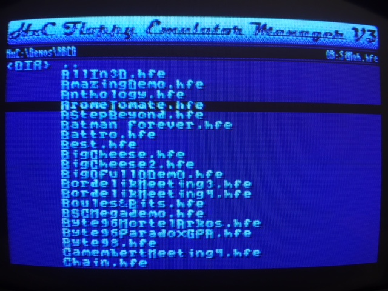

# HxC Floppy Emulator Manager V3.5 for Amstrad CPC

## Overview
This program allows to select disc images for the **HxC Floppy Emulator** device created by **Jean-Francois Del Nero** (http://hxc2001.free.fr/floppy_drive_emulator/).

## Screenshot

## Authors
- **Jean-Francois Del Nero** (http://hxc2001.free.fr/floppy_drive_emulator/)
- **Arnaud Storq** (http://norecess.cpcscene.net)

## History

**Jean-Francois Del Nero** originally created this software ; but while working, it was not convenient for the end-user. A new UI has been created, integration with the system has been improved and a ROM version was also created. Now updated are provided when firmware brings new functionality.

## How to build

### Build requirements
The following software are required:
- **SDCC 3.3.0** (recent versions are not supported yet)
- **Microsoft VisualStudio 2017**

### Launch build process
Open `Make.sln` with VisualStudio and launch (Debug).
Folder `\build` will contain disc images + ROM ready to use by the Amstrad CPC.

## How to use
On the real machine:
- **disc version**: execute `RUN"HXC` command
- **ROM version**: once installed, execute `|HXC` command
